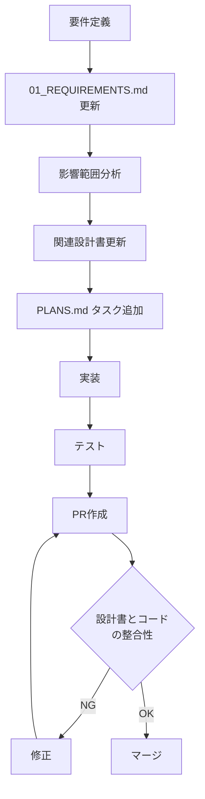

# 仕様差分管理ルール

## 目次
- [1. 概要](#1-概要)
- [2. 設計書と実装の同期プロセス](#2-設計書と実装の同期プロセス)
- [3. ユビキタス言語の管理](#3-ユビキタス言語の管理)
- [4. 変更管理フロー](#4-変更管理フロー)
- [5. レビュー時のチェック項目](#5-レビュー時のチェック項目)
- [6. ツールとワークフロー](#6-ツールとワークフロー)

## 1. 概要

### 1.1 目的

このドキュメントは、設計書（`docs/`）とコード実装の整合性を維持し、仕様のドリフト（乖離）を防ぐためのルールを定義します。

### 1.2 基本原則

1. **Single Source of Truth**: 設計書が唯一の真実のソース
2. **設計先行**: コード変更前に必ず設計書を更新
3. **継続的同期**: PR毎に設計書とコードの整合性を確認
4. **トレーサビリティ**: 要件から実装までの追跡可能性を維持

## 2. 設計書と実装の同期プロセス

### 2.1 設計書の構成

```
docs/
├── 00_INDEX.md                # 全体インデックス
├── 01_REQUIREMENTS.md         # 要件定義（FR/NFR）
├── 02_ARCHITECTURE.md         # アーキテクチャ設計
├── 03_DATA_MODEL.md          # データモデル
├── 04_UI_UX_DESIGN.md        # UI/UX設計
├── 05_FEATURES.md            # 機能詳細仕様
├── 06_SECURITY.md            # セキュリティ設計
├── 07_PERFORMANCE.md         # パフォーマンス設計
├── DOMAIN_GLOSSARY.md        # ユビキタス言語辞書
├── COMPONENT_DESIGN_GUIDE.md # コンポーネント設計ガイド
└── SPEC_SYNC_RULES.md        # 本ドキュメント
```

### 2.2 変更の起点による分類

#### パターンA: 要件変更起点
```
1. 要件変更の発生
   ↓
2. 01_REQUIREMENTS.md を更新
   ↓
3. 影響範囲を特定（他の設計書）
   ↓
4. 関連設計書を更新（02〜07）
   ↓
5. PLANS.md のタスクを更新
   ↓
6. コード実装
   ↓
7. PRで設計書とコードを同時にレビュー
```

#### パターンB: 実装時の気づき起点
```
1. 実装中に設計不備を発見
   ↓
2. 実装を一時停止
   ↓
3. 設計書を修正・補足
   ↓
4. チームで設計レビュー
   ↓
5. 承認後、実装再開
   ↓
6. PRで設計書とコードを同時にレビュー
```

### 2.3 同期確認のタイミング

| タイミング | 確認内容 |
|----------|---------|
| **コード変更前** | 対応する設計書が存在し、最新であることを確認 |
| **実装中** | ユビキタス言語辞書と実装の命名を照合 |
| **PR作成時** | 設計書とコードの差分がないことを確認 |
| **マージ前** | レビュアーが設計書とコードの整合性を承認 |
| **定期レビュー** | 月次で設計書とコードの大規模な乖離チェック |

## 3. ユビキタス言語の管理

### 3.1 DOMAIN_GLOSSARY.md の構成

ドメイン用語とコード上の命名を対応付けます：

```markdown
| ドメイン用語 | 英語表記 | コード上の名前 | 説明 | 使用箇所 |
|------------|---------|--------------|-----|---------|
| 日記エントリー | Diary Entry | DiaryEntry | 1日分の日記データ | Domain, UseCase, Repository |
| 日付値 | Date Value | DateValue | 日付を表す値オブジェクト | Domain, UseCase |
| 過去同日 | Same Date | sameDate | 同じ月日の過去の日付 | UseCase, UI |
```

### 3.2 命名同期ルール

#### 必須ルール

1. **ドメイン用語の一貫性**: 設計書とコードで同じ用語を使用
2. **英語表記の統一**: キャメルケース/パスカルケースで統一
3. **略語の禁止**: 明確な理由なく略語を使用しない
4. **辞書への登録**: 新しい用語は必ず辞書に追加

#### 例

```typescript
// ✅ 良い例（辞書に従う）
class DiaryEntry {
  getSameDateEntries(date: DateValue): DiaryEntry[] {
    // ...
  }
}

// ❌ 悪い例（辞書にない用語）
class Note {  // 「Note」は辞書にない
  getMatchingDates(d: Date): Note[] {  // 「MatchingDates」は用語が不一致
    // ...
  }
}
```

### 3.3 用語追加フロー

```
1. 新しいドメイン概念が必要になる
   ↓
2. チームで用語を議論・決定
   ↓
3. DOMAIN_GLOSSARY.md に追加
   ↓
4. PR作成・レビュー
   ↓
5. 承認後、コード実装で使用開始
```

## 4. 変更管理フロー

### 4.1 機能追加時



### 4.2 バグ修正時

```
1. バグ発見
   ↓
2. 設計書に原因があるか確認
   ↓
3a. 設計書が原因の場合
   → 設計書を修正 → コード修正
   ↓
3b. コードが原因の場合
   → コード修正のみ
   ↓
4. PR作成（設計書修正があれば含める）
```

### 4.3 リファクタリング時

```
1. リファクタリング計画
   ↓
2. 02_ARCHITECTURE.md に影響があるか確認
   ↓
3a. アーキテクチャ変更の場合
   → 設計書を更新 → コード修正
   ↓
3b. 内部実装のみの場合
   → コード修正のみ（外部仕様は不変）
   ↓
4. PR作成
```

## 5. レビュー時のチェック項目

### 5.1 PRレビュー必須チェックリスト

#### 設計書の更新

- [ ] 機能追加/変更がある場合、対応する設計書が更新されている
- [ ] 01_REQUIREMENTS.md の要件IDがコードコメントで参照されている
- [ ] 新しいコンポーネントがある場合、02_ARCHITECTURE.md に反映されている
- [ ] データモデル変更がある場合、03_DATA_MODEL.md が更新されている

#### ユビキタス言語

- [ ] 新しいドメイン概念がある場合、DOMAIN_GLOSSARY.md に追加されている
- [ ] クラス/関数名が辞書の用語と一致している
- [ ] コメントやドキュメントで辞書外の用語が使われていない

#### トレーサビリティ

- [ ] PLANS.md のタスクが完了としてマークされている
- [ ] FR/NFR要件に対するDoD（完了条件）が満たされている
- [ ] テストが要件をカバーしている

### 5.2 定期レビュー（月次）

#### 設計書の健全性チェック

```bash
# 1. 設計書の最終更新日を確認
git log --oneline docs/ | head -20

# 2. 未使用の設計要素がないか確認
# (手動で設計書とコードを照合)

# 3. PLANS.md と実装の乖離を確認
# (未完了タスクの実装状況を確認)
```

#### 用語の一貫性チェック

```bash
# 1. コード内の主要クラス名を抽出
rg "^(class|interface|type|export const) (\w+)" src/ -o

# 2. DOMAIN_GLOSSARY.md と照合
# (手動で用語の一致を確認)

# 3. 辞書にない用語が見つかったら追加または修正
```

## 6. ツールとワークフロー

### 6.1 PRテンプレート

```markdown
## 変更内容

<!-- 何を変更したか簡潔に説明 -->

## 関連する要件/タスク

- 要件ID: FR-XX, NFR-XX
- PLANS.md タスク: MVP-XXX-XX

## 設計書の更新

- [ ] 設計書の更新が必要（更新内容を以下に記載）
  - `docs/XX_XXX.md`: ...
- [ ] 設計書の更新は不要（理由: ...）

## ユビキタス言語

- [ ] 新しいドメイン用語を追加（DOMAIN_GLOSSARY.md を更新）
- [ ] 既存用語のみ使用

## チェックリスト

- [ ] 設計書とコードが一致している
- [ ] 命名がユビキタス言語辞書に従っている
- [ ] テストが要件をカバーしている
- [ ] PLANS.md のタスクを更新した
```

### 6.2 自動化ツール（将来導入候補）

#### 用語チェックスクリプト

```typescript
// scripts/check-terminology.ts
import { readFileSync } from 'fs';
import { glob } from 'glob';

// 1. DOMAIN_GLOSSARY.md から用語を読み込み
const glossary = parseDomainGlossary('docs/DOMAIN_GLOSSARY.md');

// 2. src/ 配下のコードをスキャン
const files = glob.sync('src/**/*.{ts,tsx}');

// 3. クラス名/関数名を抽出
const codeTerms = extractTermsFromCode(files);

// 4. 辞書にない用語を警告
const undefinedTerms = codeTerms.filter(term => !glossary.includes(term));

if (undefinedTerms.length > 0) {
  console.error('以下の用語がDOMAIN_GLOSSARY.mdにありません:');
  console.error(undefinedTerms.join('\n'));
  process.exit(1);
}
```

#### CIワークフローへの組み込み

```yaml
# .github/workflows/spec-sync-check.yml
name: Spec Sync Check

on:
  pull_request:
    branches: [main, develop]

jobs:
  check-terminology:
    runs-on: ubuntu-latest
    steps:
      - uses: actions/checkout@v4
      - name: Check terminology
        run: pnpm run check:terminology

  check-docs-update:
    runs-on: ubuntu-latest
    steps:
      - uses: actions/checkout@v4
      - name: Check if docs updated
        run: |
          # src/ に変更があり、docs/ に変更がない場合は警告
          if git diff --name-only origin/main | grep -q "^src/" && \
             ! git diff --name-only origin/main | grep -q "^docs/"; then
            echo "::warning::src/ に変更がありますが、docs/ が更新されていません。設計書の更新が必要ないか確認してください。"
          fi
```

### 6.3 レビュー自動化（GitHub Actions）

```yaml
# .github/workflows/pr-checklist.yml
name: PR Checklist

on:
  pull_request:
    types: [opened, edited]

jobs:
  check-pr-body:
    runs-on: ubuntu-latest
    steps:
      - name: Check PR checklist
        uses: actions/github-script@v7
        with:
          script: |
            const body = context.payload.pull_request.body || '';
            const requiredChecks = [
              '設計書とコードが一致している',
              '命名がユビキタス言語辞書に従っている',
            ];

            const missingChecks = requiredChecks.filter(check => 
              !body.includes(`[x] ${check}`)
            );

            if (missingChecks.length > 0) {
              core.setFailed(`以下のチェック項目が未完了です:\n${missingChecks.join('\n')}`);
            }
```

## 7. トラブルシューティング

### 7.1 よくある問題と対処法

#### 問題: 設計書とコードが乖離している

**対処法**:
1. どちらが正しいかを判断
2. 正しい方に合わせて他方を修正
3. PRで両方を同時に修正

#### 問題: ユビキタス言語辞書にない用語を使ってしまった

**対処法**:
1. 辞書に用語を追加（チームで合意）
2. コードをリネーム
3. PRで辞書更新とコード修正を同時に行う

#### 問題: 実装中に設計の不備を発見

**対処法**:
1. 実装を一時停止
2. Issueを作成して設計レビューを依頼
3. 設計書を修正
4. 承認後、実装再開

## 8. 成功指標

仕様差分管理の成功を測る指標：

| 指標 | 目標値 |
|-----|-------|
| 設計書の最終更新日と最新コミットの乖離 | 1週間以内 |
| DOMAIN_GLOSSARY.md の用語カバレッジ | 主要ドメイン用語の100% |
| PR時の設計書同時更新率 | 80%以上 |
| 仕様乖離による不具合件数 | 月0件 |

## まとめ

このルールに従うことで：

1. **設計とコードの一致**: 常に設計書が実装の状態を反映
2. **コミュニケーション改善**: ユビキタス言語による共通理解
3. **保守性向上**: 変更時の影響範囲が明確
4. **品質向上**: 仕様乖離による不具合を防止

新しい機能を追加する際や、既存機能を変更する際は、必ずこのルールを参照してください。
